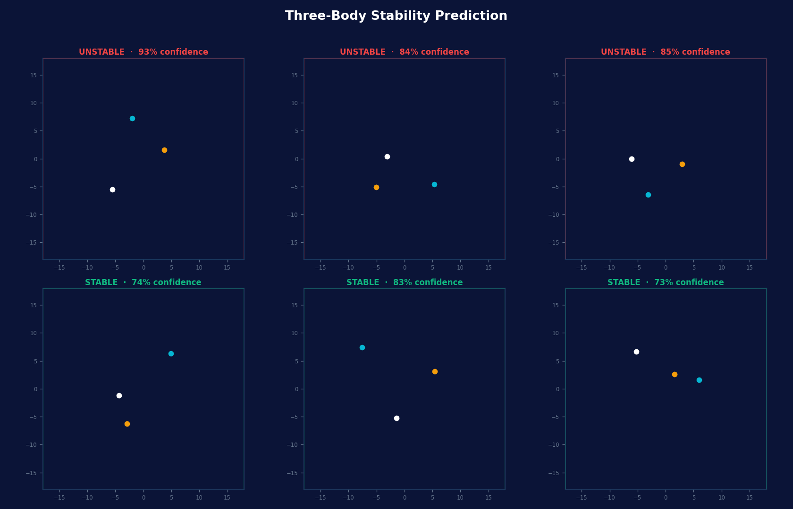

# Three-Body Problem

> Bridging classical mechanics and machine learning to classify orbital stability in a chaotic gravitational system.




---

## The Concept

This project explores the **Three-Body Problem** — a classic physics puzzle where three celestial bodies move under the influence of mutual gravitational attraction. Because the system is chaotic, it is analytically unsolvable.

By bridging **Classical Mechanics** with **Machine Learning**, the project determines whether a system's initial state will lead to a stable orbit or a chaotic escape.

---

## The Scientific Logic

### Numerical Integration
The simulator uses a step-based ODE approach to solve gravitational force vectors at each time increment.

### Chaos Theory
Visualizes *Sensitivity to Initial Conditions*: a change as small as `0.001` units in starting position leads to exponentially diverging trajectories.

### Physics-Informed ML
An `MLPClassifier` is trained on raw vector states `[x, y, vx, vy]` to learn the hidden rules of the gravitational dance.

---

## Tech Stack

| Component | Library | Role |
|-----------|---------|------|
| Language | Python 3.13 | Core runtime |
| Computation | `numpy` | Vectorized gravitational math |
| AI / ML | `scikit-learn` | MLP classifier for orbit stability |
| Visualization | `matplotlib` | Trajectory maps and sensitivity plots |

---

## Key Visualizations

**Trajectory Map** — The complex "bird's nest" of overlapping paths traced by three mutually attracting bodies.

**Sensitivity Plot** — A log-scale chart showing how a `0.001` unit perturbation grows exponentially over time.

---

## Getting Started

**1. Clone the repo**
```bash
git clone https://github.com/skrtpathania7-create/Three_body_problem.git
cd Three_body_problem
```

**2. Set up the environment**
```bash
python -m venv venv
source venv/bin/activate
```

**3. Install dependencies**
```bash
pip install numpy pandas scikit-learn matplotlib
```

**4. Generate the dataset**
```bash
python generate_data.py
```

**5. Train the classifier**
```bash
python train_ai.py
```

---

## Future Improvements

**PINNs** — Integrate conservation of energy directly into the model's loss function.

**3D Simulation** — Lift the system from a 2D plane into full 3D coordinate space.

---

*Built with Python 3.13 · numpy · scikit-learn · matplotlib*
